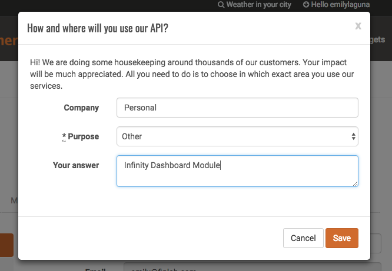
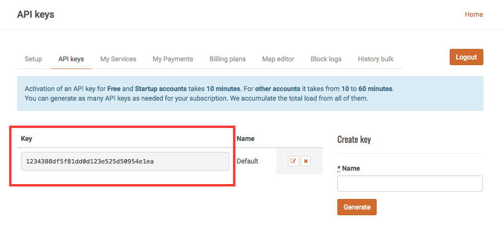

::::: Warning :::::::::::::::::::::::::::::::::::::::::
**REQUIRED** --- An OpenWeatherMap.org API Key is required to use this module.
:::::::::::::::::::::::::::::::::::::::::::::::::::::::

# Steps to finish setup

* Register for an [OpenWeatherMap.org](https://openweathermap.org/) account
* Locate your API Key
* Enter your API Key in Infinity Dashboard

## Register for an account
* Click the following link to open the [sign up page](https://home.openweathermap.org/users/sign_up)
* Follow the on screen steps to register for an account. 
* Once you've registered for your account you may be brought to a page that looks like:

Fill out the form so it looks like this, then click the <kbd>Save</kbd> button to continue to the next step.

## Locating your API Key
::::: Warning :::::::::::::::::::::::::::::::::::::::::
The API keys for newly created accounts will not be activated for 10 - 30 minutes after signing up. If the module doesn't work immediately, then please wait a few minutes then try again.
:::::::::::::::::::::::::::::::::::::::::::::::::::::::

* Click the following link to open the [API Keys page](https://home.openweathermap.org/api_keys)
* Once the page loads the default API Key will be listed under the **Key** section in the table (See Below)

* Copy the API Key by performing a <kbd>Right Click</kbd> and selecting the <kbd>Copy</kbd> action

## Entering your API Key into Infinity Dashboard
* Open Infinity Dashboard.app
* Click on the 'Module Config' item in the sidebar
* Locate the Current Weather module you want to configure
* Click the Pencil icon to open the module configuration
* Locate the **API Key** config option
* Click the **Your openweathermap.org API Key** text field
* Paste the copied API Key into the field.

::::: Alert :::::::::::::::::::::::::::::::::::::::::
**Tip** --- You can reuse this API key for multiple modules. You can <kbd>Right Click</kbd> the module in the list and select the <kbd>Duplicate</kbd> option to copy it and _ALL_ of it's configuration into a new module.
:::::::::::::::::::::::::::::::::::::::::::::::::::::::

::::: Success :::::::::::::::::::::::::::::::::::::::::
**Success** --- You can now finish configuring the module by entering a location in the **Location** configuration option. 
:::::::::::::::::::::::::::::::::::::::::::::::::::::::
